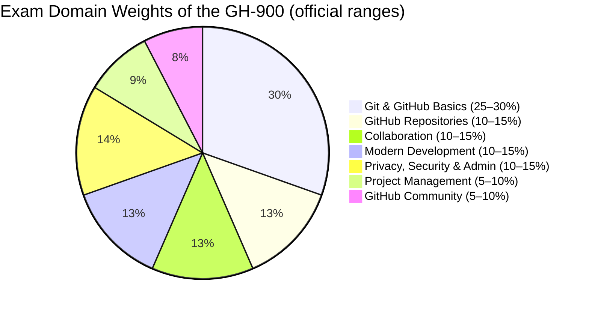
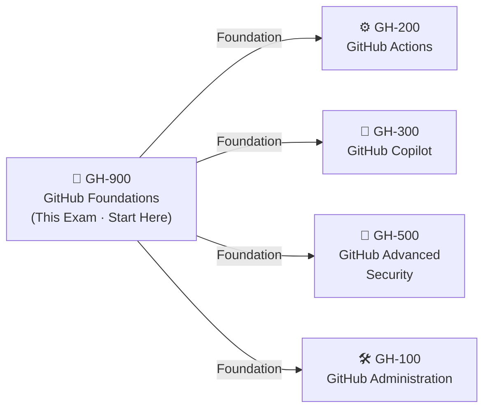

# 🐙 GH-900: GitHub Foundations
### Study Notes Repository

[](https://github.com/marcogrimaldi29/gh-900-study-notes/actions/workflows/deploy-pages.yml)
[](https://marcogrimaldi29.com/gh-900-study-notes/)
[](https://marcogrimaldi29.com)

> - 🎯 **Goal:** Earn the **GitHub Foundations** certification
> - 📅 **Notes Version:** 2026 *(aligned to the January 2026 objectives update)*
> - 🌐 **Published site:** [🐙 GH-900 Study Notes](https://marcogrimaldi29.com/gh-900-study-notes/)
> - ✍️ **Author:** [Marco Grimaldi](https://www.linkedin.com/in/marco-grimaldi29/)
> - 🔗 **Related repo:** [🤖 GH-300 GitHub Copilot Study Notes](https://marcogrimaldi29.com/gh-300-study-notes/)

> ⚠️ **Disclaimer:** These notes are for **personal use and learning only**. They are not affiliated with, endorsed by, or a substitute for official Microsoft/GitHub materials, and may become outdated as the exam evolves. Always verify against the **[official GH-900 study guide](https://learn.microsoft.com/en-us/credentials/certifications/resources/study-guides/gh-900)**.

---

## 📋 Exam At-a-Glance

| Detail | Info |
|--------|------|
| 🏅 Certification | **GitHub Foundations** |
| 📝 Passing Score | **700 / 1000** |
| 💵 Exam Price | **~$99 USD** *(varies by country; taxes may apply)* |
| ⏱️ Duration | **100 minutes** *(proctored)* |
| ❓ Question Types | Multiple choice & multi-select *(~40–60 questions)* |
| 👥 Audience | Non-developers, developers, and **all** GitHub users |
| 💻 Coding Required | **No** — concepts and platform knowledge only |
| 🛡️ Prerequisite | **None** *(recommended: hands-on GitHub experience)* |

---

## 📊 Official Domain Breakdown

> ⚠️ **Official ranges** from the Microsoft/GitHub study guide *(updated January 2026)*



| # | Domain | Official Weight | Key Topics |
|---|--------|----------------|-----------|
| 1 | Understand Git & GitHub basics | **25–30%** | Version control, Git vs. GitHub, commits, branches, GitHub Flow, Markdown |
| 2 | Work with GitHub repositories | **10–15%** | Repo structure, key files, templates, branches, insights, stars |
| 3 | Collaborate using GitHub | **10–15%** | Issues, pull requests, discussions, notifications, Gists, Wikis, Pages |
| 4 | Apply modern development practices | **10–15%** | GitHub Actions, Copilot, Codespaces, dev containers, github.dev |
| 5 | Manage projects with GitHub | **5–10%** | Projects & layouts, labels, milestones, workflows, insights |
| 6 | Understand privacy, security & administration | **10–15%** | 2FA & passkeys, roles, EMUs, visibility, branch protection |
| 7 | Explore the GitHub community | **5–10%** | Open source, Sponsors, Marketplace, InnerSource, forks, templates |

> 🔑 **Git & GitHub basics is the single largest domain (25–30%)** — master version control, the Git-vs-GitHub distinction, and the GitHub Flow first.

---

## 🗺 Certification Path



> 🐙 **GitHub Foundations** is the entry-level credential and the recommended starting point before the specialty GitHub exams.

---

## 🗂️ Repository Structure

```
gh-900-study-notes/
├── index.html                   ← 📍 Home (hero, skills grid, quick links)
├── git-github-basics/           ← Domain 1 · Git & GitHub basics (25–30%)
├── repositories/                ← Domain 2 · Work with repositories (10–15%)
├── collaboration/               ← Domain 3 · Collaborate using GitHub (10–15%)
├── modern-development/          ← Domain 4 · Modern development (10–15%)
├── project-management/          ← Domain 5 · Manage projects (5–10%)
├── security-administration/     ← Domain 6 · Privacy, security & admin (10–15%)
├── github-community/            ← Domain 7 · Explore the community (5–10%)
├── exam-tips/                   ← Exam strategy, high-yield facts & traps
└── assets/                      ← css (GitHub-dark design system), js, images
```

---

## ⚡ Quick Navigation

| Page | Topics Covered |
|------|---------------|
| [🐙 Git & GitHub Basics](https://marcogrimaldi29.com/gh-900-study-notes/git-github-basics/) | Version control, Git vs. GitHub, repos/commits/branches, accounts, GitHub Flow, Markdown, Desktop & Mobile |
| [📚 GitHub Repositories](https://marcogrimaldi29.com/gh-900-study-notes/repositories/) | Repo structure & key files, templates vs. forks, managing files, insights, stars, maintenance |
| [💬 Collaboration](https://marcogrimaldi29.com/gh-900-study-notes/collaboration/) | Issues, PRs, discussions, linking & closing keywords, templates, notifications, Gists/Wikis/Pages |
| [🚀 Modern Development](https://marcogrimaldi29.com/gh-900-study-notes/modern-development/) | Actions, Copilot (agents & plans), Codespaces & dev containers, github.dev |
| [📋 Project Management](https://marcogrimaldi29.com/gh-900-study-notes/project-management/) | Projects & layouts, labels, milestones, built-in workflows, saved replies, insights |
| [🔐 Privacy, Security & Admin](https://marcogrimaldi29.com/gh-900-study-notes/security-administration/) | 2FA & passkeys, repo/org roles, EMUs, visibility, branch protection, teams |
| [🌐 GitHub Community](https://marcogrimaldi29.com/gh-900-study-notes/github-community/) | Open source, Sponsors, following, Marketplace, InnerSource, forks & discoverability |
| [💡 Exam Tips & Caveats](https://marcogrimaldi29.com/gh-900-study-notes/exam-tips/) | Logistics, domain weights, high-yield facts, common traps, 2-week study plan |

---

### ✅ Key Study Tips

- 🧭 **Git vs. GitHub** is tested directly — Git is the distributed VCS on your machine; GitHub is the cloud platform built around it
- 🌱 Know the **GitHub Flow order** cold: branch → commit → open PR → review → merge → delete branch
- 🍴 **Clone vs. Fork** — a clone is a local copy; a fork is your server-side copy used to contribute upstream
- ⭐ **Star vs. Watch vs. Follow** — bookmark a repo · get repo notifications · see a person's activity in your feed
- 🧩 **Template vs. Fork** — a template starts fresh with no history; a fork keeps history and stays linked upstream
- 🔒 **Branch protection** is the answer to "ensure code is reviewed before it reaches `main`"
- ☁️ **github.dev vs. Codespaces** — a lightweight browser editor (no compute) vs. a full cloud dev environment that runs code
- 🔑 **Passkeys/security keys** are the strongest auth; **SMS** is the weakest 2FA method
- 📖 Read scenario questions carefully and map the situation to the **right tool** (e.g. "review a PR from your phone" → GitHub Mobile)

---

## 📚 Official Learning Resources

| Resource | Link |
|----------|------|
| 🎓 Instructor-Led Course | [GH-900T00-A](https://learn.microsoft.com/en-us/training/courses/gh-900t00) |
| 📚 GitHub Foundations Learning Paths | [Part 1](https://learn.microsoft.com/en-us/training/paths/github-foundations/) · [Part 2](https://learn.microsoft.com/en-us/training/paths/github-foundations-2/) |
| 📄 Certification Page | [GitHub Foundations](https://learn.microsoft.com/en-us/credentials/certifications/github-foundations/) |
| 📋 Skills Measured / Study Guide | [Official Study Guide](https://learn.microsoft.com/en-us/credentials/certifications/resources/study-guides/gh-900) |
| 🧪 Free Practice Assessment | [Practice Assessment](https://learn.microsoft.com/en-us/credentials/certifications/github-foundations/?practice-assessment-type=certification) |
| 🧑‍🏫 Hands-On Interactive Courses | [GitHub Skills](https://skills.github.com/) |
| 📦 GitHub Documentation | [docs.github.com](https://docs.github.com) |
| 🕹️ Exam Sandbox | [aka.ms/examdemo](https://aka.ms/examdemo) |

---

## 📚 About the Study Notes

These notes are hosted on **GitHub Pages** and published as a companion website:

👉 **[🐙 GH-900 Study Notes](https://marcogrimaldi29.com/gh-900-study-notes/)**

The site is a dependency-free front-end (HTML, CSS, vanilla JavaScript) with a **GitHub-dark design system**, a per-domain sidebar, in-page tables of contents, and mobile-friendly navigation. Content is organized by the official skills measured and is a structured, exam-focused summary based on the official [GH-900 Study Guide](https://learn.microsoft.com/en-us/credentials/certifications/resources/study-guides/gh-900) — every claim links to Microsoft Learn or GitHub Docs.

---

## ✍️ About the Author

Maintained by **[Marco Grimaldi](https://www.linkedin.com/in/marco-grimaldi29/)** — Cloud Solution Architect & Lifelong Learner.

Find more certification guides, study tips, and tech content at **[🏠 marcogrimaldi29.com](https://marcogrimaldi29.com)**

The site is continuously updated and based on my personal study notes. If you have feedback, suggestions, or corrections, feel free to [reach out](https://marcogrimaldi29.com/contact/)!

> ⭐ If these notes helped you on your GitHub Foundations journey, consider giving the repo a **star** — it helps others discover these resources and motivates continued updates!

---

## 📈 Analytics

This site uses [Umami](https://umami.is/) for privacy-friendly, cookieless analytics.

---

## ©️ Credits & Acknowledgements

Built as a custom, dependency-free static site — no framework or theme, just hand-written HTML, CSS, and vanilla JavaScript.

Created with the help of AI (Claude by Anthropic). The content has been reviewed and edited by the author for accuracy and clarity, but may contain errors. Always verify against the latest [Microsoft](https://learn.microsoft.com/en-us/credentials/certifications/github-foundations/) and [GitHub](https://docs.github.com) documentation.

> *Not affiliated with or endorsed by Microsoft or GitHub.*
